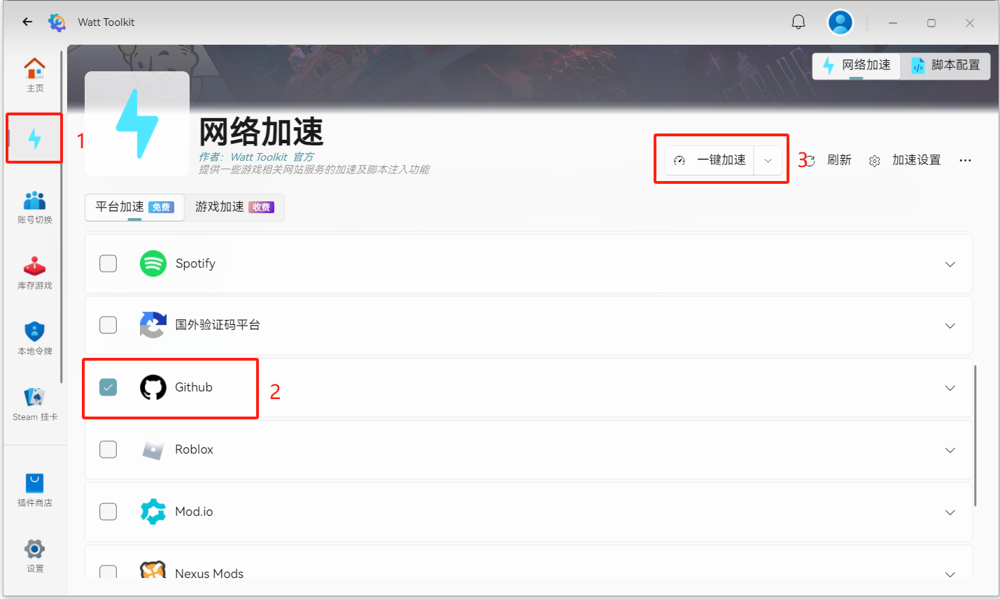
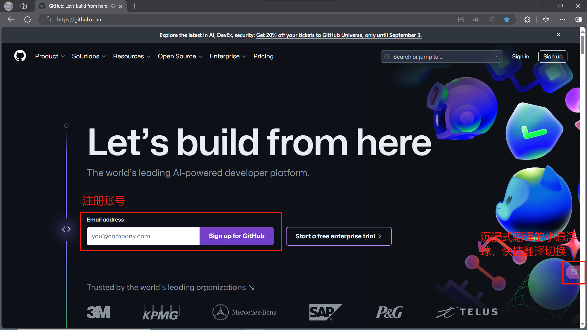
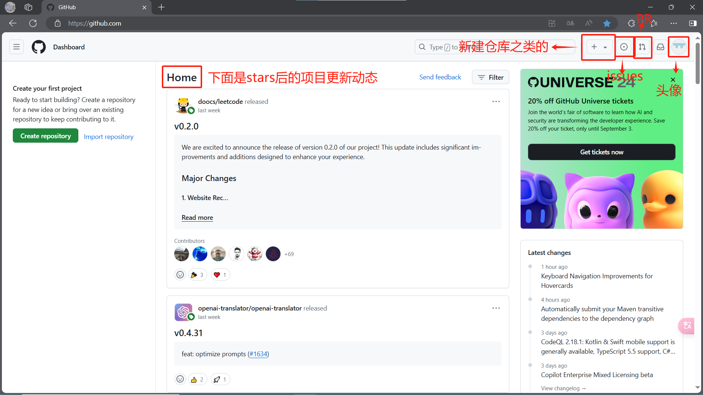
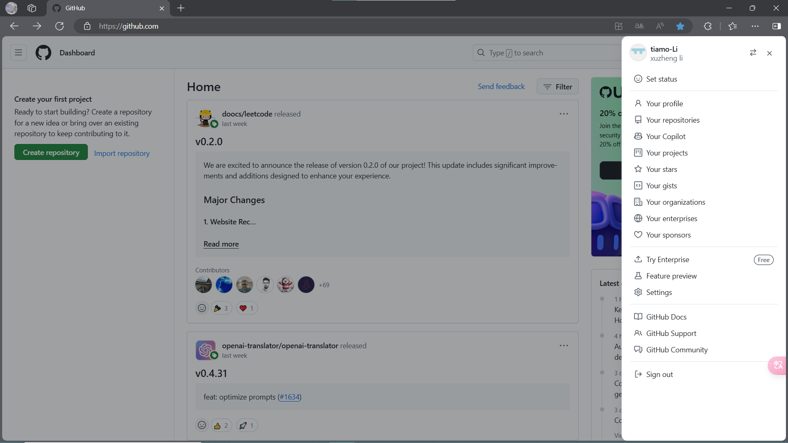
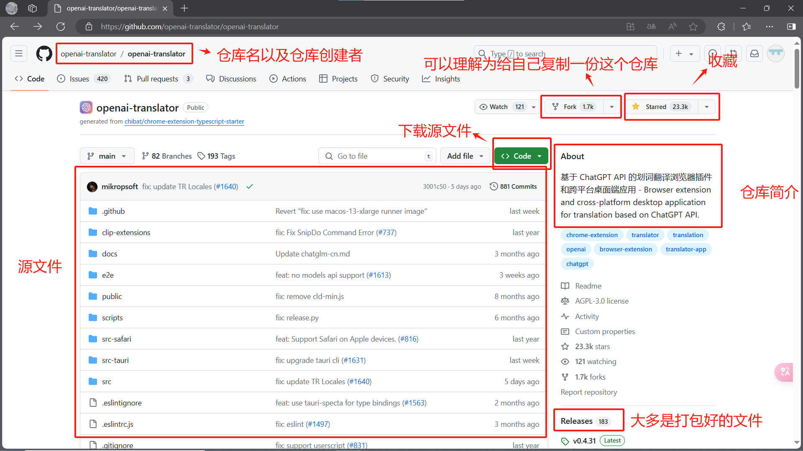
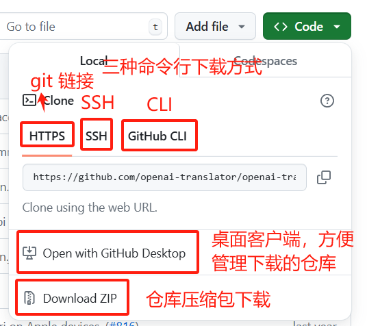

[toc]

GitHub，最重要的一课，伴随你度过余生

GitHub入门，本篇没有技术相关，仅介绍Github基础常用功能

---

# 1.进入GitHub

由于GitHub虽然没有被墙，但是被DNS随机污染，其使用体验也与被墙无异了，所以我们要先能够进入GitHub官网：[GitHub](https://github.com/)，下面会列举两种方法，如果你什么都不会，那么我推荐使用第一种，方便快捷且无脑

## Watt Toolkit

Watt Toolkit，原名Steam++，主要是一个steam工具箱，但用来加速GitHub也还是很方便的

官网链接[瓦特工具箱 - Watt Toolkit (steampp.net)](https://steampp.net/)

可以直接进入这个链接下载，下载链接直达：[Gitee 下载](https://gitee.com/rmbgame/SteamTools/releases/download/3.0.0-rc.9/Steam%20%20_v3.0.0-rc.9_win_x64.exe)

## 修改Host文件

详细方法上网搜索，推荐使用Bing搜索引擎，弃用全是广告的百度

浏览器推荐三选一：Fox、Edge和Chrome，我一直用的是Edge，信息同步比较方便

## 沉浸式翻译

因为GitHub的界面是全英文的嘛，对于许多人人特别是我这样的英语菜鸟来说看起来很难受，所以推荐一款浏览器插件“沉浸式翻译”

[沉浸式翻译 - 双语对照网页翻译插件 | PDF翻译 | 视频字幕翻译 (immersivetranslate.com)](https://immersivetranslate.com/)

# 2.注册GitHub

进入GitHub官网：[GitHub](https://github.com/)

# 3.GitHub首页

# 4.项目界面

页面继续下翻是Readme，一般作为仓库的详细介绍

常用的一般是Releases、Code、Fork和Stars

Fork 一般就是复制这个仓库给自己

Stars 就是收藏

Releases 如果本仓库是一个开源软件，那么Releases里就是打包好的软件安装包

Code 用来下载源文件，如果你是第一次尝试或者没有特殊的网络环境，那么推荐压缩包下载，因为网络环境问题，所以下载会很慢

在创建下载任务后可以将连接复制到Motrix中加速下载，见”推荐的软件“篇

# 5.学生认证

学生认证会获得许多权益，学生认证还能获取很多其他的软件权益，详情可见我的一个总结：[我们可以通过学生身份获得什么-CSDN博客](https://blog.csdn.net/weixin_73099750/article/details/133689844)

具体的学生认证方法可以在网上搜索

还有一个总结，一些可能会用到的项目：[一些stars的GitHub项目-CSDN博客](https://blog.csdn.net/weixin_73099750/article/details/138214775)

