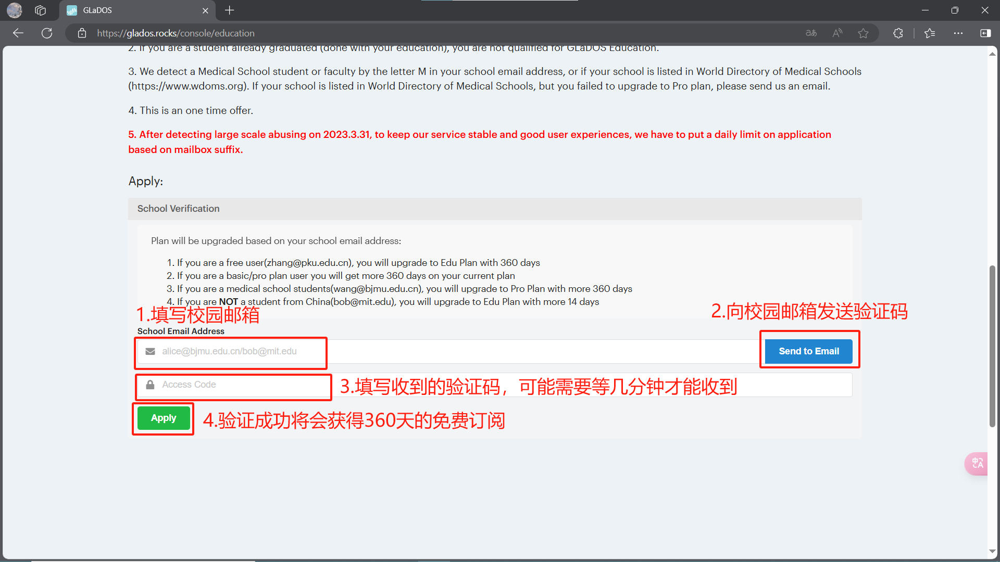

翻墙

---

[toc]

大陆防火墙保护了大陆的网民们免受境外骚扰以及受到不良信息影响，但其同时也对我们这些对外网资源有严重依赖的群体造成了极大的困扰

所以，翻墙是我们的必学一课，同时，进入GitHub的第三种方法也是翻墙，借助VPN来避免DNS被污染的解析服务器

但是，在此先忠告各位一句，我们上外网是为了学习

请记住，我们在互联网上都是裸奔，一切都有痕迹

第一，不要在外网社交软件、平台和社区之类的地方发表政治不正确的言论，也尽量不要观看与政治相关的视频

第二，尽量不要连接公共 WiFi 翻墙，比如校园网~~（在校园网下只是学习的话应该也没人管）~~

第三，免费机场少用，网络质量不好，并且你的个人信息有风险，因为搭建机场成本还是不低的，凭什么免费给你用是吧

第四，免费的加速器少用，并且也不是很推荐各机场自家的加速器，使用Clash就挺好的

第五，别点赌博、诈骗之类的东西

---

# 1. 常用的方法——“机场”订阅

“机场”是中转服务器机房的别称，作为学生，且是第一次使用，我们本篇教程使用先使用免费的机场作为演示 [glados.rocks](https://glados.rocks/)

但是作为日常使用的话不推荐

## 获取机场订阅链接

注册登陆以后，在首页的最下方找到Education，或者可以直接点击这个链接 [GLaDOS](https://glados.rocks/console/education)

然后我们获取订阅连接

## 软件代理

然后我们来下载管理订阅的软件[Clash-for-Windows_Chinese汉化版(github.com)](https://github.com/Z-Siqi/Clash-for-Windows_Chinese)

进入Releases

打开Clash-for-Windows，并同意权限，如果你关闭了防火墙，是不会有这个弹窗的

好了，现在可以开始愉快的上网了，记得在不用的时候关闭代理

同时，由于是免费的，所以网络质量不是很好。如果要换其他机场的话，可以尝试西瓜，性价比还是挺高的，网站 [西瓜-发布页 (xiguajiasu.cloud)](https://ac.xiguajiasu.cloud/) ，我的[推广链接](https://www.xiguajiasu.life/?path=register&code=0vR8EWF7)

# 2. 局域网

对于安卓用户来说，可以使用安卓版的Clash软件代理，详见第四部分

对于 ios 系统的用户来说，代理软件的购买和下载均需要非国区账号，最推荐的代理软件是 Shadowrocket小火箭，美区价格2.99美元，B站上有许多注册非国区账号的教程，这里就不再过多介绍

对于没有在移动设备上安装代理软件的各位，我们可以先使用 Clash for Windows 为局域网其他设备提供代理服务

## 配置Clash for Windows

在首页我们可以看到，开启允许局域网后，Clash会监听所有接口，否则只监听本机127.0.0.1

如果你安装了服务模式，即上图中服务模式旁小绿球亮起的状态，请卸载，如果没有，跳过这一步

确保为下图的状态

查看本机IP地址，将其作为其他设备的代理服务器地址

## 加入局域网并代理

配置并打开电脑的移动热点，设置->网络和Internet->移动热点，以Win10为例

连接热点，配置代理为手动，输入主机名即电脑IP，端口号默认为7890，以 OriginOS 4为例

然后这个设备就可以快乐上网了

## 绑定地址

如果你有多个设备连接了电脑热点，但只想要其中一台有魔法，那么可以绑定该设备的IP，在设备的 WiFi 设置中可以看到

# 3. 原理

如果你完成了上面的操作，那么你可以去油管（YouTube）上看到许多大佬关于这方面的讲解，首推电丸科技AK [硬核翻墙系列](https://www.youtube.com/watch?v=XKZM_AjCUr0) 。至于我，知晓不深，也难以讲清，就不献丑了

对于Clash的更多说明以及使用方法，请参考该文档：[什么是 Clash?](https://a76yyyy.github.io/clash/zh_CN/)

# 4. 其他代理软件

在上面的演示中，我们均使用了 Clash for Windows 这款代理软件，虽然这是最受欢迎的代理软件，但是在2023年下半年由于不可抗因素，作者在GitHub上删除了相关库，并且 Clash 和 Clash Premium 核心也被删除，所以 Clash for Windows、Clash for Android 和 ClashX 等软件也都停止了更新，这些软件依旧可以使用，但不再提供维护

再附上基于Clash核心的代理软件的[备份仓库链接](https://github.com/clashdownload)

Clash Meta 是基于原 Clash 核心的重写项目，支持原 Clash Premium 核心的大部分功能。由于原 Clash Premium 核心已经删库停更，现在还在继续更新的 Clash 客户端，几乎都采用 Clash Meta 内核，是原 Clash 核心的继任者

以下是最受欢迎的基于Clash Meta 核心的代理软件：

1. Windows、MacOS、Linux系统：[Clash Verge Rev](https://github.com/clash-verge-rev/clash-verge-rev)
2. 安卓系统：[Clash Meta For Android](https://github.com/MetaCubeX/ClashMetaForAndroid)

还有一些其他基于 Clash Meta 核心的代理软件，如下：

1. Windows系统：[v2rayN](https://github.com/2dust/v2rayN)
2. MacOS系统：[ClashX.Meta](https://github.com/MetaCubeX/ClashX.Meta)

上述软件中大多是支持内核切换的

还有一款界面非常可爱的代理软件：[Clash Nyanpasu](https://github.com/LibNyanpasu/clash-nyanpasu)，其原生支持多种内核，包括 Clash Premium、Clash Meta 和 Clash Rust，用户可以根据个人喜好选择使用

最后是 [sing-box](https://github.com/SagerNet/sing-box) 系列，需要提醒的是，虽然 sing-box 还在更新，但下面这两款软件目前停止了更新

1. Windows、Linux系统：[NekoBox For PC](https://github.com/MatsuriDayo/nekoray)
2. 安卓系统：[NekoBox for Android](https://github.com/MatsuriDayo/NekoBoxForAndroid)

