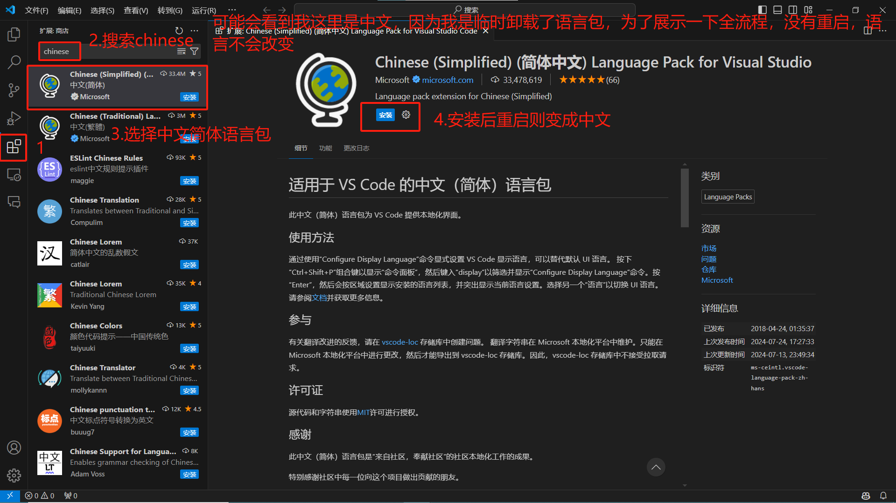
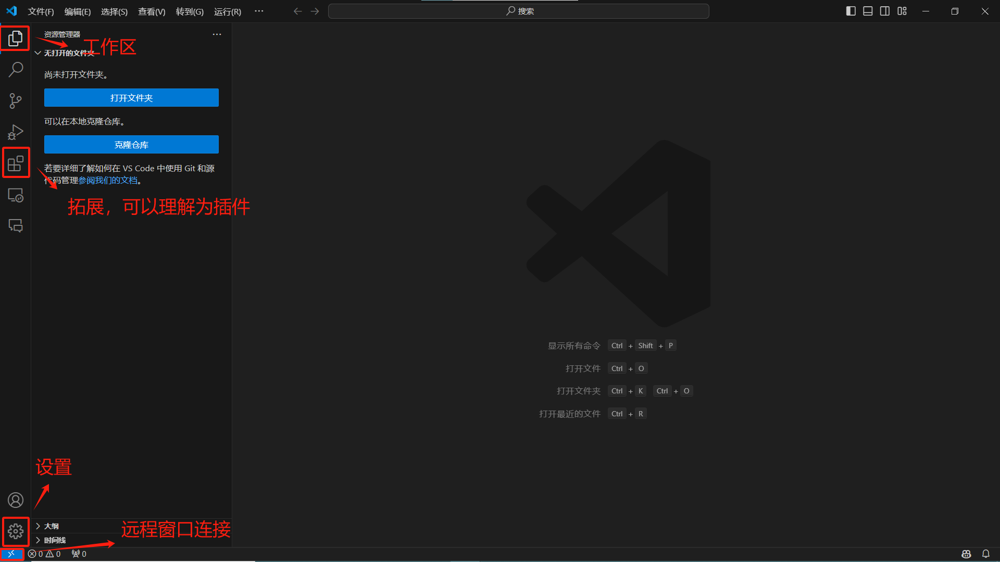
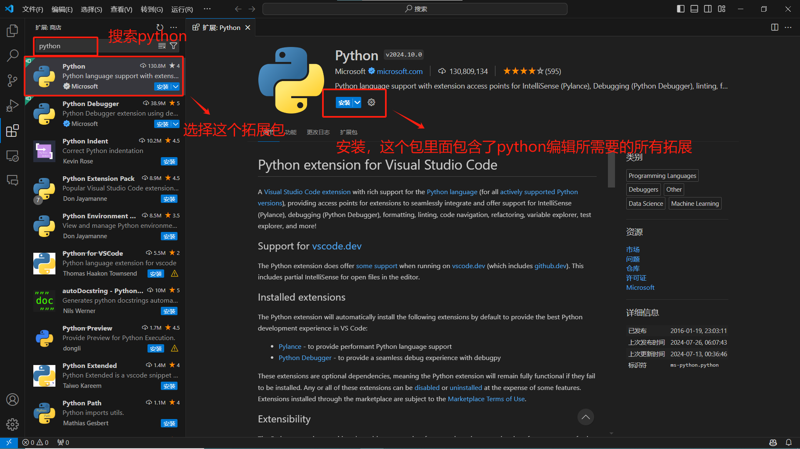
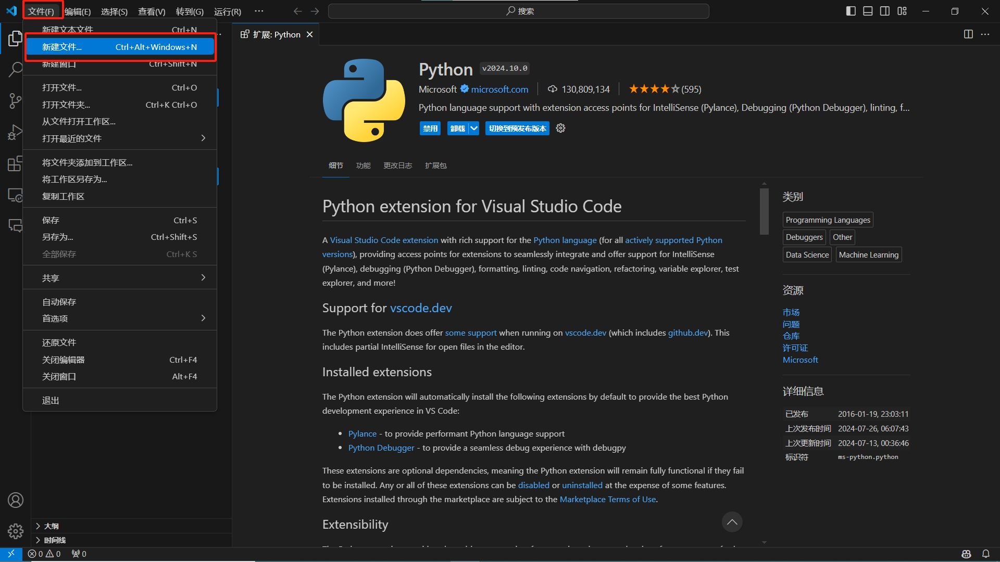

[toc]

VScode，微软金主爸爸用钱砸出来的宇宙最强编辑器，最起码在Windows系统下是公认的

VScode入门，本篇没有技术相关，仅介绍VScode初始常用功能

并介绍一些其他的环境配置，以及对应的VScode配置

# 1.软件安装

官网[Visual Studio Code - Code Editing. Redefined](https://code.visualstudio.com/)

下载并安装好软件后，对于我这种英语小菜鸡来说，第一步且是最重要的一步就是汉化

拓展就是这四个小方块的图标，同时拓展也是VScode最重要且强大的东西

然后我来介绍一下界面以及常用的一些快捷键

# 2. Python相关配置

## python安装

python官网：[Welcome to Python.org](https://www.python.org/)

推荐安装python3.9版本，下载链接：https://www.python.org/ftp/python/3.9.13/python-3.9.13-amd64.exe

安装时一直下一步就可以了

注意勾选Add to Path，将python加入环境变量，就不需要手动配置环境变量了

虽然后续主要使用conda虚拟环境来管理python，但在本机环境里面有一个python环境还是很重要的

## 在VScode里安装python拓展

然后我们就可以在VScode中新建并编辑python脚本文件`.py`了

# 3. Anaconda以及jupyter

