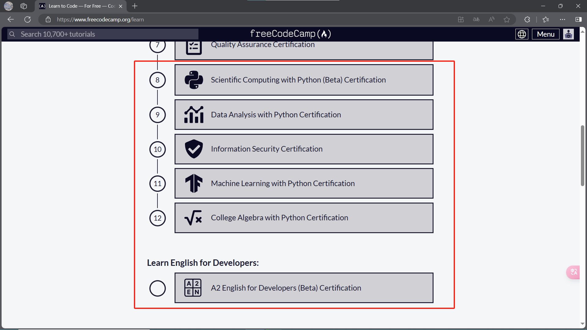
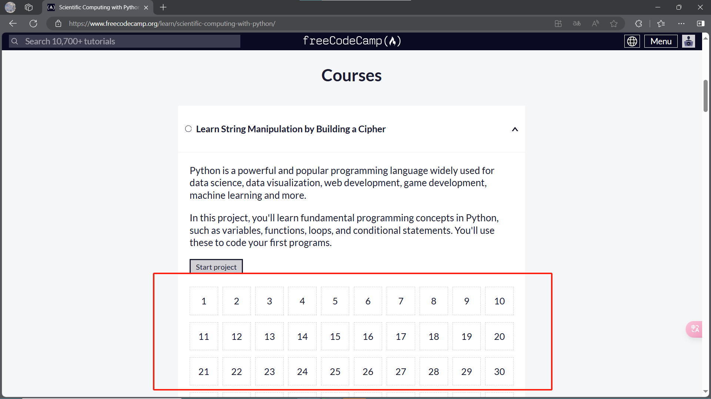
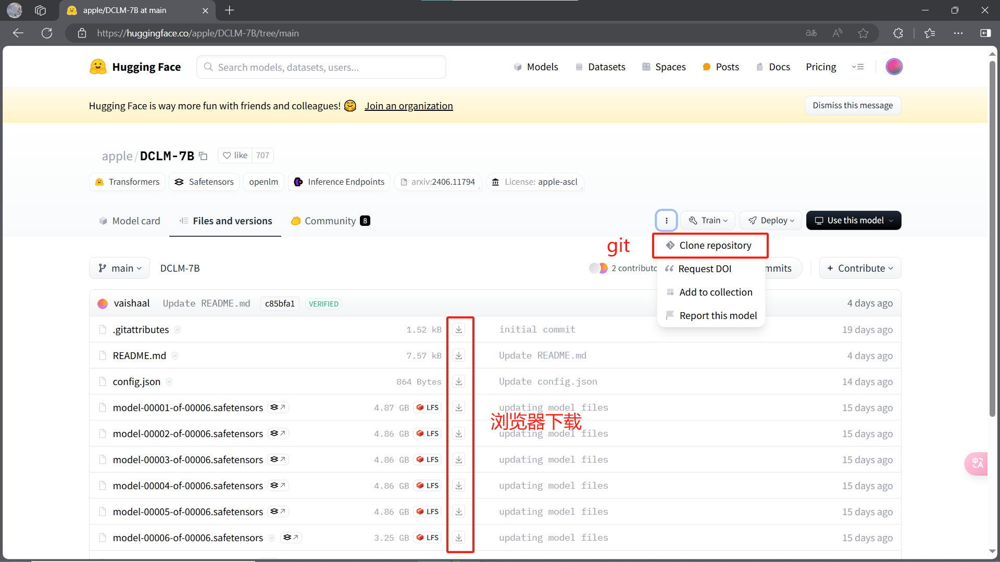

[toc]

# freecodecamp

https://www.freecodecamp.org/

freecodecamp，一个绝妙的程序员学习网站，~~我们也算是程序员吧~~

可以直接通过GitHub账户登录

进入首页后，我们能看到许多课程，下面这些对我们专业来说是比较有用的

课程采用了闯关式的设计，每个方向都设计成了n个关卡，就像是下面这样

# Deepseek

[DeepSeek | 深度求索](https://deepseek.com/)

虽然说GPT4是问答大模型中效果最优秀的，但是贵哇

Deepseek算是国内免费问答模型里的一流梯队了，至少写代码的能力算是一流，推荐一下

# papers with code

https://paperswithcode.com/

可以看作是论文代码开源社区

# AutoDL

https://www.autodl.com/

算是比较便宜的云GPU，大家肯定会用得上的

学生认证后会获得会员身份，价格也是会有优惠

我的推广链接：

# DeepL

被誉为最强机翻，[DeepL翻译：全世界最准确的翻译](https://www.deepl.com/zh/translator)，当然效果还是不如大模型的

# Hugging Face

可以当作模型界的GitHub，基本使用方法差不多

主要的两种模型下载方式，见下图

# Kaggle

https://www.kaggle.com/

# 阿里天池

