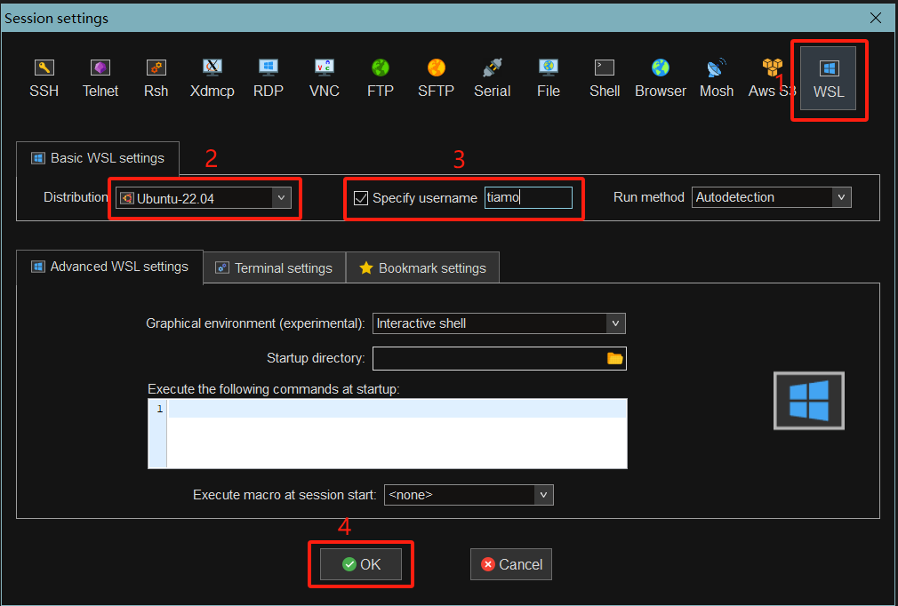
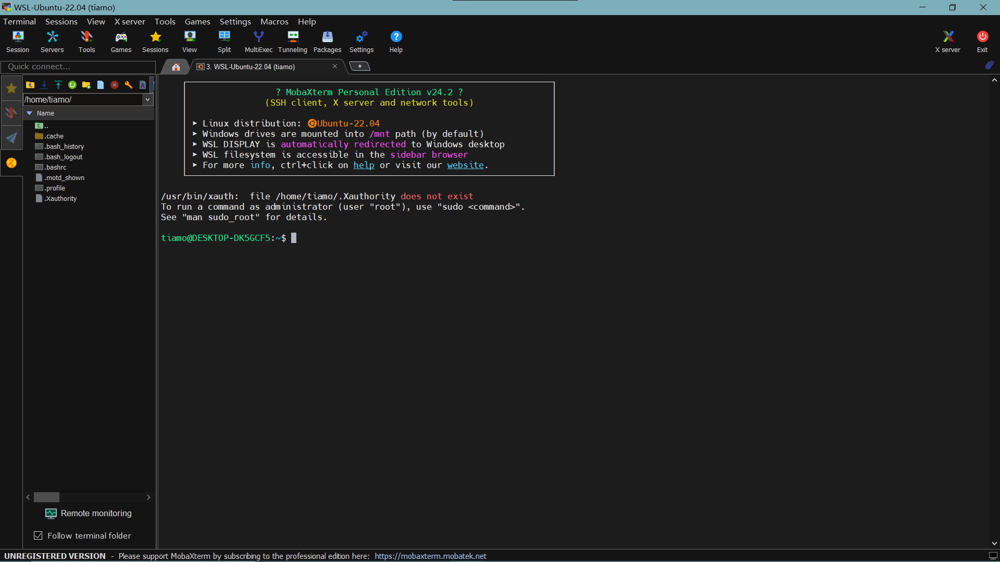

[toc]

WSL很方便哈，因为我们主要使用的还是Windows嘛，比双系统切换起来方便多了

并且相对于虚拟机来说，WSL的系统占用也会小很多

可以参考官方文档：[适用于 Linux 的 Windows 子系统文档 | Microsoft Learn](https://learn.microsoft.com/zh-cn/windows/wsl/)

注意，在安装Linux发行版前，最好关闭可能修改hosts文件的软件，比如Watt Toolkit的Hosts加速

因为这可能会让你的新系统的hosts文件变成一坨，如果这已经发生了，那么修改hosts文件就好

```bash
sudo nano /etc/hosts
```

# 1. 安装WSL

如果是第一次安装WSL，我们可以直接在在Powershell中执行命令来完成安装

系统中自带的Powershell是旧版，可以参考[PowerShell 文档 - PowerShell | Microsoft Learn](https://learn.microsoft.com/zh-cn/powershell/?view=powershell-7.4)来安装新版Powershell

1. 使用管理员身份运行Powershell

2. 执行命令

   ```bash
   # 安装WSL，但不安装Linux发行版
   wsl --install --no-distribution
   ```

# 2. 安装Ubuntu-22.04

1. 重启电脑，再次使用管理员身份运行Powershell

2. 执行命令

    ```bash
    # 查看可用发行版列表
    wsl --list --online
    
    # 返回结果
    NAME                            FRIENDLY NAME
    Ubuntu                          Ubuntu
    Debian                          Debian GNU/Linux
    kali-linux                      Kali Linux Rolling
    Ubuntu-18.04                    Ubuntu 18.04 LTS
    Ubuntu-20.04                    Ubuntu 20.04 LTS
    Ubuntu-22.04                    Ubuntu 22.04 LTS
    Ubuntu-24.04                    Ubuntu 24.04 LTS
    OracleLinux_7_9                 Oracle Linux 7.9
    OracleLinux_8_7                 Oracle Linux 8.7
    OracleLinux_9_1                 Oracle Linux 9.1
    openSUSE-Leap-15.6              openSUSE Leap 15.6
    SUSE-Linux-Enterprise-15-SP5    SUSE Linux Enterprise 15 SP5
    SUSE-Linux-Enterprise-15-SP6    SUSE Linux Enterprise 15 SP6
    openSUSE-Tumbleweed             openSUSE Tumbleweed
    ```

    ```bash
    # 安装Ubuntu-22.04
    wsl --install Ubuntu-22.04
    ```

3. 等待一段时间，安装完成后会自己启动WSL，需要新建用户名和密码

   注意：输入密码时为盲人键入，光标会保持在原处，正常键入密码即可

卸载Linux发行版：

```bash
# 还是以Ubuntu-22.04为例
wsl --unregister Ubuntu-22.04
```

# 3. 基础配置

虽然官方推荐WSL搭配Windows Terminal使用，但显然MobaXterm更加直观一些，最起码多了个文件目录~~（虽然这软件的大方块光标不会闪，看起来不太习惯）~~

## 3.1. 配置MobaXterm

下载并安装好MobaXterm后，打开软件，新建Session



启动后界面如下



## 3.2. 修改软件包源

1. 使用nano打开软件源文件

   ```bash
   sudo nano /etc/apt/sources.list
   ```

2. 使用以下内容替换原内容，注意，以下内容仅适用于Ubuntu-22.04

   具体可查看[ubuntu | 镜像站使用帮助 | 清华大学开源软件镜像站 | Tsinghua Open Source Mirror](https://mirrors.tuna.tsinghua.edu.cn/help/ubuntu/)

   ```bash
   # 默认注释了源码镜像以提高 apt update 速度，如有需要可自行取消注释
   deb https://mirrors.tuna.tsinghua.edu.cn/ubuntu/ jammy main restricted universe multiverse
   # deb-src https://mirrors.tuna.tsinghua.edu.cn/ubuntu/ jammy main restricted universe multiverse
   deb https://mirrors.tuna.tsinghua.edu.cn/ubuntu/ jammy-updates main restricted universe multiverse
   # deb-src https://mirrors.tuna.tsinghua.edu.cn/ubuntu/ jammy-updates main restricted universe multiverse
   deb https://mirrors.tuna.tsinghua.edu.cn/ubuntu/ jammy-backports main restricted universe multiverse
   # deb-src https://mirrors.tuna.tsinghua.edu.cn/ubuntu/ jammy-backports main restricted universe multiverse
   
   # 以下安全更新软件源包含了官方源与镜像站配置，如有需要可自行修改注释切换
   deb http://security.ubuntu.com/ubuntu/ jammy-security main restricted universe multiverse
   # deb-src http://security.ubuntu.com/ubuntu/ jammy-security main restricted universe multiverse
   
   # 预发布软件源，不建议启用
   # deb https://mirrors.tuna.tsinghua.edu.cn/ubuntu/ jammy-proposed main restricted universe multiverse
   # # deb-src https://mirrors.tuna.tsinghua.edu.cn/ubuntu/ jammy-proposed main restricted universe multiverse
   ```

   Ctrl+O并回车保存，Ctrl+X退出编辑器

3. 更新软件包目录及软件包，并删除不再需要的依赖

   ```bash
   sudo apt update
   sudo apt upgrade -y
   sudo apt autoremove
   ```

## 3.3. Git配置

1. 初始配置

   ```bash
   # 配置用户名，这里双引号是因为用户名中可以存在空格，如果没有的话则不需要，并且用户名中不能有大写字母
   git config --global user.name "your_name"
   # 配置用户邮箱
   git config --global user.email <your_email>
   ```

2. Git LFS

   ```bash
   # 下载Git LFS
   sudo apt-get install git-lfs
   # 启用Git LFS
   git lfs install
   ```

3. ssh公/私钥对

   ```bash
   # 如果是第一次创建，那么一路回车就好
   ssh-keygen -t rsa -b 4096 -C "your_email"
   # 启动ssh-agent
   eval "$(ssh-agent -s)"
   # 将私钥添加到ssh-agent
   ssh-add ~/.ssh/id_rsa
   # 查看公钥
   cat ~/.ssh/id_rsa.pub
   ```

4. 配置Git alias

   ```bash
   # 编辑.gitconfig文件
   nano ./.gitconfig
   ```

   ```bash
   # 看个人喜好设置，以下为示例
   [alias]
       g = git
       a = add
       st = status
       cm = commit
       cl = clone
       ps = push
       pl = pull
   ```

## 3.4. GUI界面

此部分看个人需要，如果不需要使用带GUI界面的应用则不推荐安装


## 3.5. Docker安装

与直接在Linux系统中安装步骤相同，注意需要在Win中挂梯子，Clash需要开启TUN模式

参考文档：[乌班图 | Docker 文档 --- Ubuntu | Docker Docs](https://docs.docker.com/engine/install/ubuntu/)


# 4. 开发环境配置

## 4.1. Python环境

1. 安装Python

   ```bash
   # 更新软件包列表，一般在安装软件前都会做这个操作
   sudo apt update
   # 安装Python
   sudo apt install python3 python3-pip
   ```

## 4.2. VScode配置

参考文档：[使用 Visual Studio Code 在适用于 Linux 的 Windows 子系统中进行开发_Vscode中文网 (github.net.cn)](https://vscode.github.net.cn/docs/remote/wsl)

[使用 Visual Studio Code 在适用于 Linux 的 Windows 子系统中工作_Vscode中文网 (github.net.cn)](https://vscode.github.net.cn/docs/remote/wsl-tutorial)
