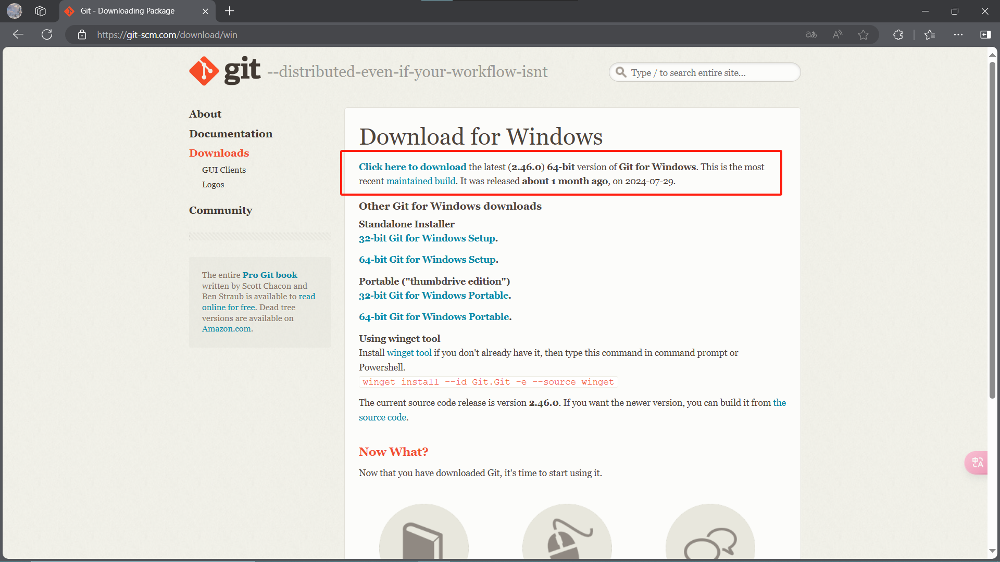
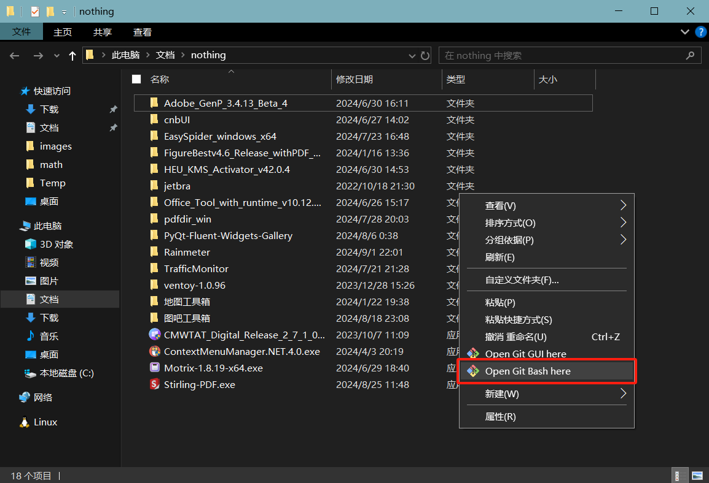

[toc]

Git，一个分布式版本控制系统
本教程在Windows系统中展示，在命令行中使用，推荐Git自带的终端——Git Bash

# 1. Git安装

Git官网[Git (git-scm.com)](https://git-scm.com/)，其中同样提供官方教程：[Git - Book (git-scm.com)](https://git-scm.com/book/zh/v2)
Win版本[下载地址](https://git-scm.com/download/win)

安装完成后，在文件目录背景处右键可以打开Git Bash

